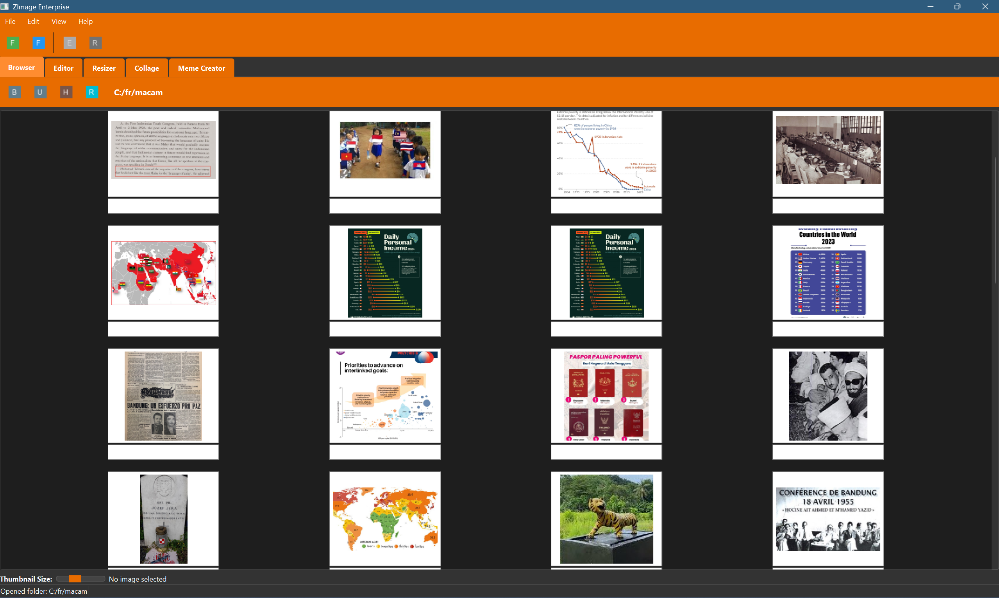

# ZImage

A image management and editing solution for fun but no profit.




*Screenshot placeholder: Replace with an actual screenshot of the application*

## Features

### Image Browser
- Fast, responsive thumbnail browsing
- Advanced image viewing with pan, zoom, and navigation controls
- Folder history and navigation
- Metadata viewing
- Keyboard shortcuts for efficient workflow


*Screenshot placeholder: Browser with thumbnails and fullscreen viewing*

### Image Editor
- Multiple drawing tools (Pen, Line, Rectangle, Ellipse, Text)
- Customizable brush properties
- Canvas and background control
- Text tool with font selection
- Collage creation


*Screenshot placeholder: Editor with drawing tools*

### Image Resizer
- Batch processing of multiple images
- Multiple output size options
- Aspect ratio control
- Preview functionality
- Easy-to-use interface


*Screenshot placeholder: Resizer with batch functionality*

### Collage Creator
- Combine multiple images into a single composition
- Horizontal or vertical orientation options
- Adjustable spacing between images
- Save as a new image file


*Screenshot placeholder: Collage creator with multiple images*

### Meme Creator
- Add text to images with customizable properties
- Support for classic meme formats (top/bottom text)
- Text styling options (font, size, color, outline)
- Alignment controls
- Zoom and pan functionality for precise text placement
- Export in multiple formats


*Screenshot placeholder: Meme Creator with text overlay*

## Installation

### Requirements
- Python 3.7+
- PyQt6
- Pillow (PIL Fork)
- Other dependencies listed in requirements.txt

### Setup

```bash
# Clone the repository
git clone https://github.com/mexyusef/zimage.git
cd zimage

# Install dependencies
pip install -r requirements.txt

# Run the application
python -m zimage.main
```

## Usage

### Browser Mode
- Use the thumbnail browser to navigate through images
- Adjust thumbnail size with the slider
- Double-click or press Enter to view images in fullscreen
- Navigate with arrow keys
- Use mouse wheel to zoom in/out and drag to pan in fullscreen view

### Editor Mode
- Select from various drawing tools
- Customize brush size and color
- Create and edit images
- Save edits in various formats

### Resizer Mode
- Add images to the batch list
- Set your desired dimensions
- Maintain aspect ratio if needed
- Process multiple images at once

### Collage Mode
- Add multiple images to the collage
- Choose between horizontal or vertical orientation
- Adjust spacing between images
- Create and save the final composition

### Meme Creator Mode
- Load an image using the toolbar or panel button
- Add text at the top, bottom, or custom positions
- Customize text appearance (font, size, color, outline)
- Use the classic meme format option for quick creation
- Export your meme in various formats
- Zoom and pan using mouse wheel and Ctrl+drag

## Keyboard Shortcuts

- **Browser**:
  - Enter: View selected image fullscreen
  - Arrow keys: Navigate between images
  - Esc: Exit fullscreen mode

- **Fullscreen Viewer**:
  - Mouse wheel: Zoom in/out
  - Left mouse drag: Pan the image
  - +/-: Zoom in/out
  - F: Fit to screen
  - R: Reset zoom
  - Left/Right arrows: Navigate between images
  - Esc: Exit fullscreen

- **Meme Creator**:
  - Mouse wheel: Zoom in/out
  - Ctrl+Drag: Pan the image
  - Spacebar: Reset zoom

## Development

This project follows a modular architecture:
- `core`: Core functionality and utilities
- `models`: Data models
- `services`: Business logic and services
- `ui`: User interface components
- `controllers`: Application controllers
- `resources`: Application resources (icons, styles, etc.)

## License

MIT License - See [LICENSE](LICENSE) file for details

## Contributing

Contributions are welcome! Please feel free to submit a Pull Request.
